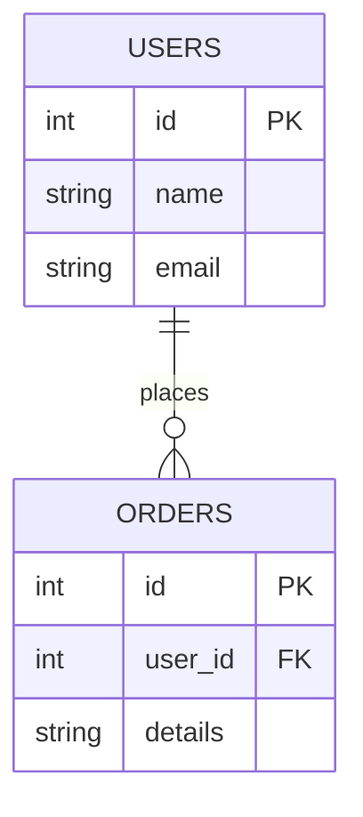

# Skapa och underhålla databaser

### Inledning
Att skapa och underhålla databaser är en grundsten i modern webbutveckling. Denna artikel guidar dig genom nyckelkoncepten och bästa praxis för att utforma och hantera databaser med PHP och MySQL, med exempel som följer konventioner som ofta används i PHP-baserade ramverk.

### Grundläggande databaskoncept

Innan du börjar programmera, är det avgörande att förstå de grundläggande byggstenarna i en databas. Dessa inkluderar koncepten av tabeller, kolumner, rader och relationer. Dessa element är de fundamentala komponenterna i de flesta databaser och förståelse för dem är nyckeln till effektiv databasdesign och hantering.

#### Tabeller
En databastabell är en samling av relaterade data och representerar en entitet i ditt system. Varje tabell består av rader och kolumner, likt ett kalkylblad. En tabell ska vanligtvis representera en specifik typ av entitet. Till exempel, en tabell som heter `users` kan representera användarna i din applikation.

#### Exempel på tabell: `users`
```plaintext
+----+----------+--------------------+
| id | name     | email              |
+----+----------+--------------------+
| 1  | Alice    | alice@example.com  |
| 2  | Bob      | bob@example.com    |
| 3  | Charlie  | charlie@sample.com |
+----+----------+--------------------+
```
I detta exempel har tabellen `users` tre kolumner: `id`, `name` och `email`. Varje rad representerar en unik användare.

#### Kolumner
Kolumner i en tabell representerar de olika attributen hos entiteten. Varje kolumn har en specifik datatyp som definierar vilken sorts data den kan innehålla, som textsträngar, heltal, datum/tid, etc.

- **`id`**: Vanligtvis en unik identifierare för varje rad i tabellen. Detta är i regel en primärnyckel som unikt identifierar varje post. Detta gör du genom att aktivera `auto_increment` på id-fältet.
- **`name`**: En textsträng som representerar användarens namn.
- **`email`**: En textsträng som lagrar användarens e-postadress.

#### Rader
Varje rad i en tabell representerar en specifik instans av den entitet tabellen beskriver. I `users`-tabellen ovan är varje rad en unik användare med specifika värden för `id`, `name`, och `email`.

#### Relationer
Databaser tillåter relationer mellan olika tabeller, vilket speglar hur olika entiteter är relaterade till varandra. Relationer modelleras ofta genom användning av primära och främmande nycklar.

- **Primärnyckel (Primary Key)**: En unik identifierare för varje rad i en tabell. I vårt exempel är `id`-kolumnen i `users`-tabellen en primärnyckel.
- **Främmande Nyckel (Foreign Key)**: En kolumn i en tabell som länkar till primärnyckeln i en annan tabell, skapar en relation mellan de två tabellerna.

#### Exempel på relationer
För att illustrera relationer, låt oss introducera en ny tabell som heter `orders`. En order är relaterad till en användare, så `orders`-tabellen kan ha en främmande nyckel som refererar till `users`-tabellen.

Tabell: `orders`
```plaintext
+----+---------+-------------------+--------+
| id | user_id | product           | amount |
+----+---------+-------------------+--------+
| 1  | 1       | Laptop            | 1200   |
| 2  | 2       | Smartphone        | 800    |
| 3  | 1       | External Hardrive | 150    |
+----+---------+-------------------+--------+
```
I detta exempel är `user_id` i `orders`-tabellen en främmande nyckel som refererar till `id` i `users`-tabellen, vilket visar vilken användare som gjort varje order.

Att förstå dessa grundläggande databaskoncept är nödvändigt för att kunna designa och hantera en databas effektivt. Genom att förstå hur tabeller, kolumner, rader och relationer fungerar och samspelar, kan du skapa en strukturerad och effektiv databas som

### Databasnormalisering

Databasnormalisering är en process för att strukturera en databas på ett sätt som minskar redundans och förbättrar dataintegritet. Målet med normalisering är att dela upp data i logiska tabeller och etablera relationer mellan dessa tabeller för att främja konsistens och minska upprepning av data. 

#### Exempel på Icke-normaliserad tabell
Låt oss börja med en icke-normaliserad tabell som innehåller både användar- och adressuppgifter.

Tabell: `users`
```plaintext
+----+----------+-------------------+-----------------+------------+
| id | name     | email             | address         | city       |
+----+----------+-------------------+-----------------+------------+
| 1  | Alice    | alice@example.com | 123 Apple St.   | Townsville |
| 2  | Bob      | bob@example.com   | 456 Banana Ave. | Villecity  |
+----+----------+-------------------+-----------------+------------+
```
I denna tabell, `users`, finns det redundans och en risk för inkonsekventa data, särskilt om en användare har flera adresser eller om adressinformationen uppdateras.

#### Processen för normalisering
För att normalisera denna tabell, skulle du dela upp informationen i två relaterade tabeller: `users` och `addresses`.

1. **Ändra tabellen `users`**: Tabellen `users` innehåller nu endast information som är specifik för användaren.

   Tabell: `users`
   ```plaintext
   +----+----------+-------------------+
   | id | name     | email             |
   +----+----------+-------------------+
   | 1  | Alice    | alice@example.com |
   | 2  | Bob      | bob@example.com   |
   +----+----------+-------------------+
   ```
   Här är `id` en primärnyckel som unikt identifierar varje användare.

2. **Skapa tabellen `addresses`**: Tabellen `addresses` lagrar adressinformation och relaterar varje adress till en användare i `users`-tabellen.

   Tabell: `addresses`
   ```plaintext
   +----+---------+-----------------+-----------+
   | id | user_id | address         | city      |
   +----+---------+-----------------+-----------+
   | 1  | 1       | 123 Apple St.   | Townsville|
   | 2  | 2       | 456 Banana Ave. | Villecity |
   +----+---------+-----------------+-----------+
   ```
   I `addresses`, är `id` primärnyckeln, och `user_id` är en främmande nyckel som refererar till `id` i `users`-tabellen.

#### Fördelar med normalisering
1. **Minskad redundans:** Genom att dela upp data minskar vi upprepningen av information. Användarens personuppgifter lagras endast en gång i `users`-tabellen.
2. **Förbättrad dataintegritet:** Ändringar i användaruppgifter behöver endast göras på ett ställe, vilket minskar risken för inkonsekventa eller felaktiga data.
3. **Flexibilitet:** Det är enkelt att lägga till nya adresser för en användare utan att ändra `users`-tabellen.
4. **Effektivitet:** Sökningar och uppdateringar blir mer effektiva eftersom de mindre tabellerna är snabbare att bearbeta.

Normalisering är en viktig process i databasdesign som bidrar till en mer effektiv, flexibel och underhållsvänlig databasstruktur. Genom att förstå och tillämpa normaliseringsprinciper kan du säkerställa att din databas hanterar data på ett optimalt sätt.

### Planera din databasstruktur

En noggrann planering av din databasstruktur är ett kritiskt steg i designprocessen. Detta innefattar att definiera tabeller, deras relationer, och de specifika datatyperna för varje kolumn. Använda ER-diagram (Entity-Relationship) kan vara mycket hjälpsamma för att visualisera strukturen och relationerna i din databas.

#### Definiera tabeller och deras syfte
Börja med att identifiera de olika entiteterna som din applikation kommer att hantera. Varje entitet bör representeras av en tabell. Till exempel, om du bygger en e-handelsplattform, kan dina primära tabeller vara `users`, `products`, `orders`, och `reviews`.

#### Bestäm kolumnerna och deras datatyper
För varje tabell, definiera de specifika kolumnerna och välj lämpliga datatyper baserat på vilken typ av data de kommer att lagra. Datatyper inkluderar:

- **INTEGER:** Ett heltal. Används ofta för att lagra numeriska värden som ålder, antal produkter, etc. Är också standard för primärnycklar och främmande nycklar.
- **VARCHAR (eller STRING):** En variabel längd på textsträngar. Passar för de flesta textbaserade data som namn, adresser, e-postadresser.
- **TEXT:** För längre textsträngar, som produktbeskrivningar eller recensioner.
- **DATETIME/TIMESTAMP:** För att lagra datum och tider. Användbart för att spåra händelser såsom när en order skapades eller en användare registrerade sig.
- **BOOLEAN:** Ett sanningsvärde, sant eller falskt. Bra för statusmarkörer, som om en recension har godkänts eller inte.
- **FLOAT/DOUBLE:** För att lagra decimaltal, användbart för priser, betyg, etc.

#### Exempel:
Tabell: `users`
```plaintext
+--------------+--------------+--------------+-----------+
| id           | name         | email        | join_date |
|--------------|--------------|--------------|-----------|
| INTEGER (PK) | VARCHAR(100) | VARCHAR(100) | DATETIME  |
+--------------+--------------+--------------+-----------+
```
I detta exempel är `id` en INTEGER som också fungerar som primärnyckel (PK), `name` och `email` är VARCHAR-typ, och `join_date` är av typen DATETIME.

#### Skapa ER-diagram
ER-diagrammet (Entity-Relationship) hjälper till att visualisera hur olika tabeller är relaterade till varandra. Detta inkluderar att identifiera relationstyper som "en-till-en", "en-till-många", och "många-till-många". Till exempel, en `user` kan ha många `orders` (en-till-många-relation), men varje `order` är kopplad till en specifik `user`.



#### Definiera relationer mellan tabeller
Använd primära och främmande nycklar för att definiera relationer mellan tabeller. En främmande nyckel i en tabell refererar till en primärnyckel i en annan tabell, vilket skapar en relation mellan dem.

Att planera din databasstruktur kräver noggrann övervägande av entiteter, deras attribut, datatyper, och relationer mellan dem. Genom att skapa ett detaljerat ER-diagram och välja rätt datatyper, lägger du en solid grund för din databas som kommer att underlätta framtida underhåll, skalbarhet och utveckling.

### Skapa din databas med PHP och MySQL
Med MySQL kan du skapa en databas och dess tabeller genom SQL-kommandon. PHP används för att interagera med MySQL-databasen. För att skapa en tabell `users`, kan du använda ett SQL-kommando som:

```sql
CREATE TABLE users (
    id INT AUTO_INCREMENT PRIMARY KEY,
    name VARCHAR(100),
    email VARCHAR(100),
    created_at TIMESTAMP DEFAULT CURRENT_TIMESTAMP
);
```

### Bli bekväm med SQL
SQL (Structured Query Language) är nyckeln till att interagera med din databas. Grundläggande kommandon inkluderar `SELECT`, `INSERT`, `UPDATE`, och `DELETE`. PHP erbjuder funktioner för att köra dessa SQL-kommandon mot din MySQL-databas.

### Implementera säkerhetsåtgärder

I databashantering är säkerheten inte bara en eftertanke; det är en fundamental del av design- och utvecklingsprocessen. När du arbetar med databaser, särskilt i webbapplikationer, är det avgörande att skydda mot olika säkerhetshot, där SQL-injektion är bland de mest kritiska. Användningen av PHP:s PDO (PHP Data Objects) och MySQLi för beredda uttalanden är centrala tekniker för att säkra dina databasoperationer.

#### SQL-injektioner
SQL-injektion är en attackmetod där en angripare lyckas infoga eller "injicera" skadlig SQL-kod i en databasfråga. Detta kan leda till obehörig åtkomst till databasen, dataläckage, och till och med databasmanipulering. För att skydda mot dessa attacker är det viktigt att använda säkra metoder för att hantera användarinput.

#### Beredda uttalanden (Prepared Statements)
Beredda uttalanden är ett effektivt sätt att förhindra SQL-injektioner. De skiljer mellan kod och data, oavsett vilken användarinput som tillhandahålls. Detta innebär att användarinputen inte kan tolkas som SQL-kod, vilket minskar risken för skadliga injektioner.

#### Användning av PDO
PHP Data Objects (PDO) erbjuder ett konsistent gränssnitt för att arbeta med olika databashanteringssystem. PDO:s användning av beredda uttalanden är särskilt användbart för att hantera SQL-frågor säkert.

#### Exempel på PDO med beredda uttalanden:
```php
<?php
$pdo = new PDO('mysql:host=exempelhost;dbname=exempeldb', 'användarnamn', 'lösenord');
$stmt = $pdo->prepare("SELECT * FROM users WHERE email = :email");
$stmt->bindParam(':email', $email);
$stmt->execute();
?>
```
I detta exempel förbereds ett SQL-uttalande där användarens e-postadress binds som en parameter. Detta förhindrar att användarinputen exekveras som en del av SQL-frågan.

#### Användning av MySQLi
MySQLi är ett annat PHP-bibliotek som stöder beredda uttalanden och erbjuder både ett procedurorienterat och ett objektorienterat gränssnitt.

#### Exempel på MySQLi med beredda uttalanden:
```php
<?php
$mysqli = new mysqli("exempelhost", "användarnamn", "lösenord", "exempeldb");
$stmt = $mysqli->prepare("SELECT * FROM users WHERE email = ?");
$stmt->bind_param("s", $email);
$stmt->execute();
?>
```
Här förbereds en liknande fråga som med PDO, med användning av MySQLi:s objektorienterade gränssnitt.

#### Datarening
Utöver att använda beredda uttalanden, bör du också rena data som kommer från användare för att förhindra andra typer av attacker, som Cross-Site Scripting (XSS). Detta innebär att du rensar användarinput för att ta bort potentiellt skadliga tecken.

Att implementera robusta säkerhetsåtgärder i din databas är avgörande för att skydda både data och systemets integritet. Genom att använda tekniker som beredda uttalanden med PDO eller MySQLi och vara noggrann med datarening, kan du effektivt skydda din databas mot SQL-injektioner och andra säkerhetshot. Regelbunden översyn och uppdatering av dina säkerhetsrutiner är också viktigt för att bibehålla en hög säkerhetsnivå över tid.

### Praktik och fortsatt lärande
Det bästa sättet att bli skicklig är genom praktik. Skapa egna projekt och experimentera med att bygga olika databasstrukturer. Använd också online-resurser och handledningar för att fördjupa dina kunskaper.

### Slutsats
Att bli skicklig på att designa och hantera databaser med PHP och MySQL är en värdefull färdighet för varje webbutvecklare. Genom att följa dessa steg och kontinuerligt praktisera och lära dig nya tekniker, kan du bygga robusta och effektiva databassystem som ligger till grund för dynamiska webbapplikationer.